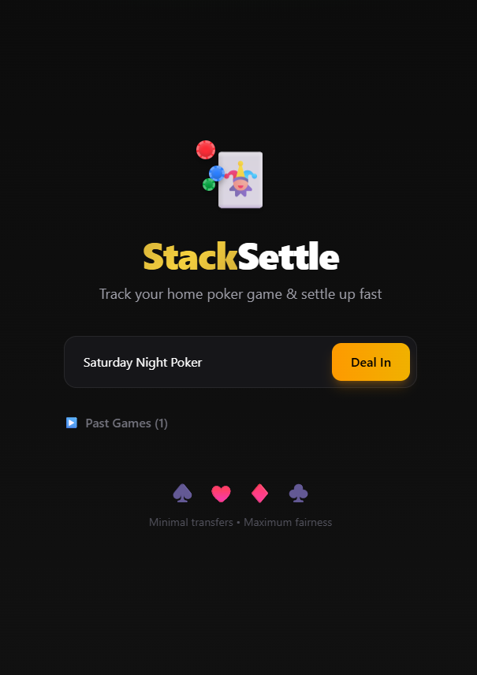
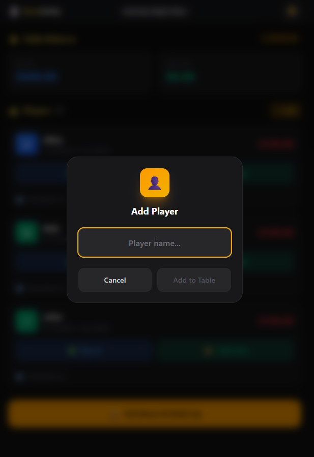
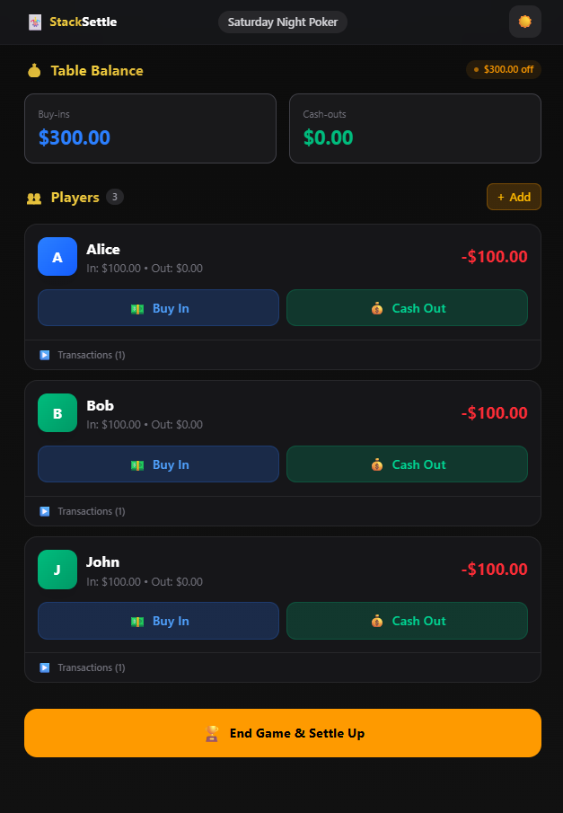
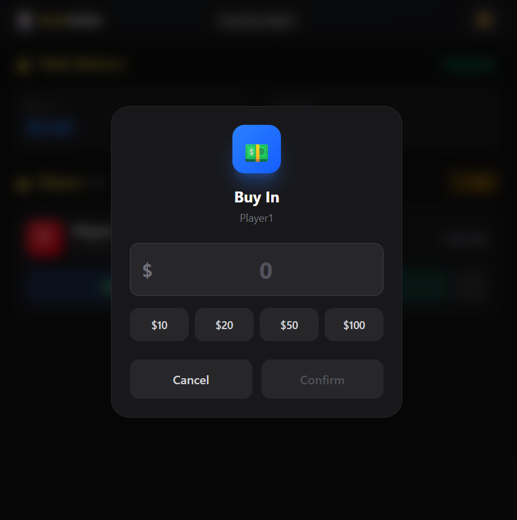
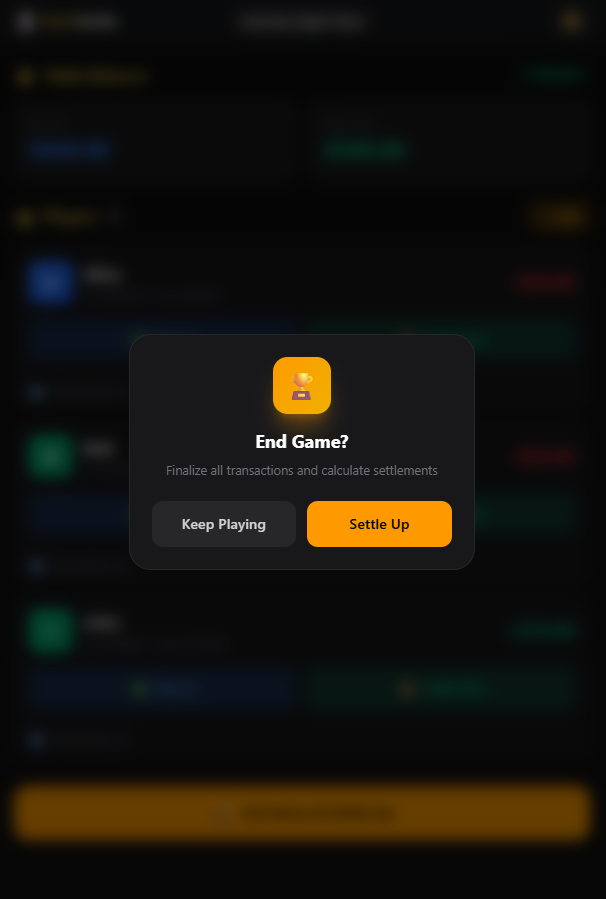
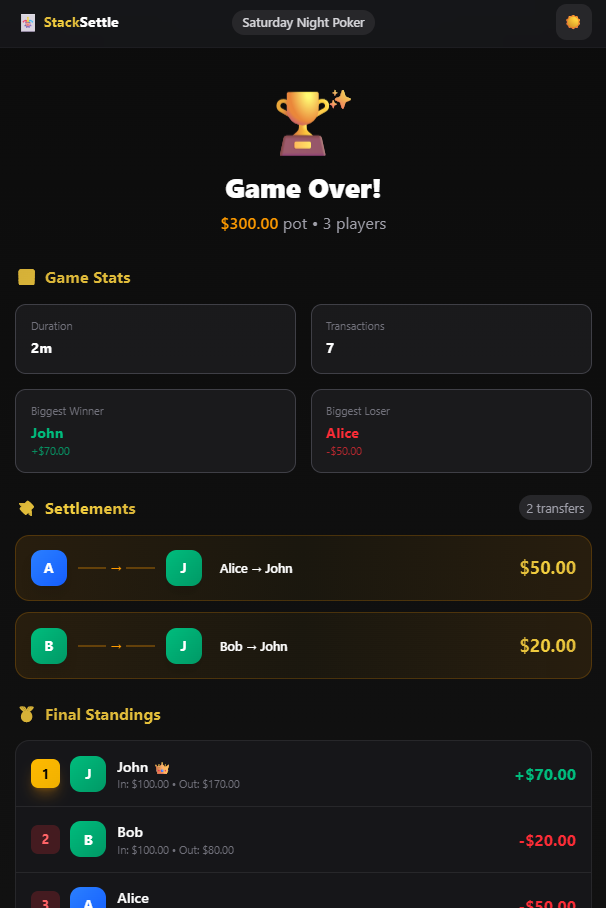

# 🃏 StackSettle

A modern web application for home poker games that tracks multiple buy-ins and cash-outs per player and, at game end, computes the minimum number of transfers required to settle balances between players.


## ✨ Features

- **Multi-Game Support** - Run multiple poker games simultaneously and switch between them
- **Player Management** - Add/remove players with ease
- **Transaction Tracking** - Record buy-ins and cash-outs with timestamps
- **Live Balances** - See real-time per-player totals (buy-ins, cash-outs, net balance)
- **Smart Settlement** - Greedy algorithm minimizes the number of transfers needed
- **Game Statistics** - View duration, transaction count, biggest winner/loser
- **Dark/Light Mode** - Beautiful poker-themed UI in both modes
- **Local Persistence** - All data saved to localStorage
- **Progressive Web App** - Install on your device for offline access
- **Mobile-Friendly** - Responsive design works on all devices

## 📸 Screenshots

### Home Screen
Create new games or continue existing ones.



### Add Player
Quick amount buttons for easy transaction entry.



### Active Game
Track buy-ins and cash-outs for each player in real-time.



### Add Transaction
Record buy-ins and cash-outs with quick amount buttons and custom values.



### End Game
View game stats and minimal settlement transfers.



### Settlement Screen
See the complete leaderboard with winner/loser rankings.



## 🚀 Getting Started

### Prerequisites

- Node.js 18+ 
- npm, yarn, pnpm, or bun

### Installation

1. Clone the repository:
```bash
git clone https://github.com/yourusername/stack-settle.git
cd stack-settle
```

2. Install dependencies:
```bash
npm install
```

3. Run the development server:
```bash
npm run dev
```

4. Open [http://localhost:3000](http://localhost:3000) in your browser.

## 🧠 How Settlement Works

StackSettle uses a **greedy debt-settlement algorithm** to minimize the number of transfers:

1. Calculate each player's net balance (cash-outs - buy-ins)
2. Build lists of creditors (positive balance) and debtors (negative balance)
3. Sort both lists by amount (descending)
4. Match debtors to creditors greedily, each transfer eliminating at least one balance

### Example

**Input:**
- Alice: Buy-in $100, Cash-out $180 → Net: +$80
- Bob: Buy-in $200, Cash-out $120 → Net: -$80  
- Charlie: Buy-in $50, Cash-out $50 → Net: $0

**Settlement Output:**
```
Bob → Alice: $80
```

Only 1 transfer needed instead of multiple!

## 🛠️ Tech Stack

- **Framework:** Next.js 15 (App Router)
- **Language:** TypeScript
- **Styling:** Tailwind CSS v4
- **State Management:** React Context + useReducer
- **Persistence:** localStorage
- **Testing:** Jest

## 🔗 Routes

| Route | Description |
|-------|-------------|
| `/` | Landing page - app introduction and features |
| `/games` | Games screen - create new games or continue existing ones |
| `/games/[id]` | Active game - track buy-ins and cash-outs |
| `/games/[id]/settlement` | Settlement screen - view final balances and transfers |

## 📁 Project Structure

```
stack-settle/
├── app/
│   ├── games/
│   │   ├── [id]/
│   │   │   ├── settlement/page.tsx # Settlement route
│   │   │   └── page.tsx            # Active game route
│   │   └── page.tsx                # Games list route
│   ├── globals.css                 # Global styles & Tailwind config
│   ├── layout.tsx                  # Root layout with providers
│   ├── manifest.ts                 # PWA manifest
│   └── page.tsx                    # Landing page
├── components/
│   ├── ActiveGame.tsx              # Active game screen
│   ├── GamesScreen.tsx             # Games management screen
│   ├── LandingPage.tsx             # Landing page
│   ├── Providers.tsx               # Theme & Game context providers
│   └── SettlementScreen.tsx        # Final settlement view
├── lib/
│   ├── constants.ts                # Shared app constants
│   ├── GameContext.tsx             # Global state management
│   ├── ThemeContext.tsx            # Dark/light mode
│   ├── settlement.ts               # Core settlement algorithm
│   ├── settlement.test.ts          # Unit tests
│   ├── storage.ts                  # localStorage helpers
│   └── types.ts                    # TypeScript interfaces
└── public/
    └── images/                     # Screenshots & icons
```

## 🧪 Running Tests

```bash
npm test
```

All 18 tests cover:
- Balance calculations
- Settlement algorithm
- Currency parsing/formatting
- Edge cases (zero balances, single player, etc.)

## 📱 Progressive Web App

StackSettle is a full PWA that can be installed on any device:

### Installation
- **iOS:** Open in Safari → Tap Share → "Add to Home Screen"
- **Android:** Open in Chrome → Tap menu → "Install app"
- **Desktop:** Click the install icon in your browser's address bar

### PWA Features
- 📲 Install to home screen for app-like experience
- 🔄 Works offline after first load
- ⚡ Fast load times with caching
- 📱 Touch-friendly buttons and gestures
- 🎨 Native-like animations
- 📐 Responsive layouts for all screen sizes

## 🎨 Theming

Toggle between dark and light modes with the sun/moon button. The poker theme includes:
- Gold accent colors
- Card suit decorations
- Smooth animations
- Frosted glass effects

## 📄 License

MIT License - feel free to use for your home games!

---

Built with ♠️ ♥️ ♦️ ♣️ for poker nights everywhere.
